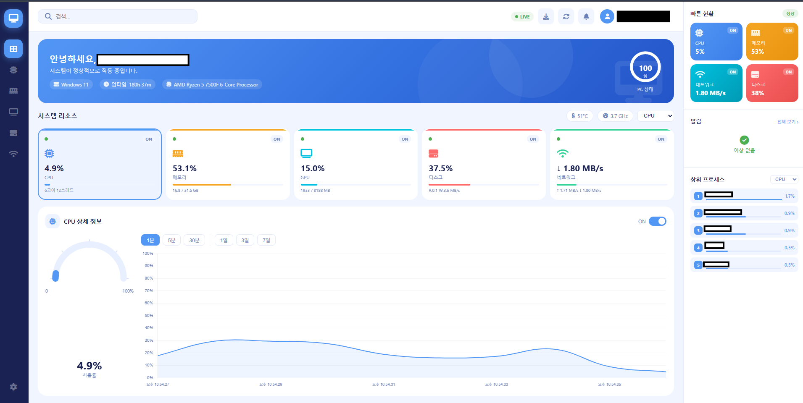

# PC 모니터링 대시보드

실시간으로 CPU, 메모리, GPU, 디스크, 네트워크 상태를 브라우저에서 확인할 수 있는 로컬 대시보드입니다.  
Flask 백엔드와 순수 HTML/CSS/JS 프론트엔드로 구성되어 있으며, 인터넷 없이 완전히 오프라인 환경에서도 동작합니다.

---

## 주요 기능

| 기능 | 설명 |
|------|------|
| **실시간 모니터링** | CPU·메모리·GPU·디스크·네트워크를 1초 간격으로 갱신 |
| **코어별 CPU 사용률** | 논리 코어 각각의 사용률을 바 형태로 표시 |
| **GPU 지원** | NVIDIA GPU의 사용률·VRAM·온도 표시 (GPU 없는 PC는 자동 숨김) |
| **프로세스 순위** | CPU/메모리 점유율 상위 5개 프로세스 실시간 표시 |
| **장기 히스토리** | 1분 평균을 SQLite에 저장, 최대 7일치 보관 |
| **기간별 차트** | 최근 1분·30분 / 1일·3일·7일 단위로 차트 전환 |
| **CSV 내보내기** | 저장된 히스토리를 CSV 파일로 다운로드 (Excel 호환) |
| **시스템 트레이** | CMD 창 없이 백그라운드 실행, 트레이 아이콘 우클릭으로 종료 |
| **오프라인 동작** | 외부 CDN 없이 모든 정적 파일을 로컬에서 서빙 |

---

## 스크린샷

> 실행 후 `http://localhost:5000` 접속



---

## 기술 스택

**백엔드**
- Python 3.10+
- Flask — 로컬 웹 서버
- psutil — CPU·메모리·디스크·네트워크 정보 수집
- nvidia-ml-py (pynvml) — NVIDIA GPU 정보 수집
- SQLite (표준 라이브러리) — 히스토리 영구 저장

**프론트엔드**
- Chart.js — 실시간/히스토리 차트
- Font Awesome — 아이콘
- 순수 HTML/CSS/JS (프레임워크 없음)

**패키징**
- PyArmor — 소스코드 난독화
- PyInstaller — 단일 폴더 exe 빌드
- pystray + Pillow — 시스템 트레이 아이콘

---

## 개발 환경에서 실행

### 1. 의존성 설치

```bash
pip install -r requirements.txt
```

### 2. 서버 실행

```bash
python app.py
```

또는 Windows에서 `run.bat` 더블클릭

### 3. 브라우저 접속

```
http://localhost:5000
```

---

## 배포용 exe 빌드

PyArmor로 소스코드를 난독화한 뒤 PyInstaller로 패키징합니다.  
빌드 결과물인 `dist/PC_Dashboard/` 폴더 전체를 zip으로 압축해서 배포하세요.

> `_internal/` 폴더가 exe와 함께 있어야 정상 실행됩니다.

---

## 파일 구조

```
dashboard/
├── app.py              # Flask 백엔드 (API, 데이터 수집, SQLite)
├── launcher.py         # 배포용 진입점 (시스템 트레이 + Flask 시작)
├── run.bat             # 개발용 빠른 실행 스크립트
├── requirements.txt    # Python 의존성 목록
├── templates/
│   └── index.html      # 대시보드 UI
└── static/
    ├── css/
    │   └── style.css   # 스타일시트
    ├── js/
    │   └── dashboard.js # 실시간 업데이트 및 차트 로직
    └── vendor/
        ├── chartjs/    # Chart.js (오프라인용 로컬 번들)
        └── fontawesome/ # Font Awesome (오프라인용 로컬 번들)
```

---

## 데이터 저장

실행 중 `history.db` (SQLite) 파일이 자동 생성됩니다.

- 저장 주기: **1분 평균**
- 보관 기간: **최근 7일**
- 저장 항목: CPU(%), 메모리(%), GPU(%), 다운로드/업로드(MB/s), 디스크 읽기/쓰기(MB/s)
- 개인 정보 없음: 호스트명·IP·프로세스명은 저장되지 않습니다

CSV 내보내기는 대시보드 우측 상단의 다운로드 버튼을 클릭하면 됩니다.

---

## 시스템 요구사항

- Windows 10 / 11
- Python 3.10 이상 (개발 실행 시)
- NVIDIA GPU 선택사항 (없으면 GPU 패널 자동 숨김)

---

## 라이선스

MIT
